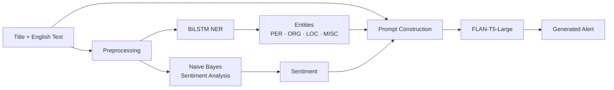

# NLP Alert Generation Pipeline

End-to-end Natural Language Processing system that converts English text into a concise natural-language alert by combining three complementary NLP components:

1. **Named Entity Recognition** with a custom BiLSTM model initialized with Word2Vec embeddings.
2. **Sentiment Analysis** with a Naive Bayes-style classifier implemented from scratch.
3. **Alert Generation** with Google **FLAN-T5-Large** through Hugging Face Transformers.

The system takes a title and an English text sample, extracts relevant entities, predicts the overall sentiment, and conditions a sequence-to-sequence language model on those signals to generate a short alert grounded in the original text.

> **Team project:** developed as part of NLP coursework at Universidad Pontificia Comillas ICAI. I contributed across the full development lifecycle, including preprocessing, model development, training, integration, inference, testing, and debugging.

---

## Architecture



The complete inference workflow is orchestrated by `src/pipeline.py`.

---

## Example Workflow

Input:

```text
Title:
The Batman

Text:
Matt Reeves delivers a dark and visually stunning film,
with Robert Pattinson giving an outstanding lead performance.
```

Pipeline:

```text
1. Named Entity Recognition
   → Matt Reeves [PER]
   → Robert Pattinson [PER]

2. Sentiment Analysis
   → Positive

3. Alert Generation
   → FLAN-T5 receives the title, entities, sentiment and source text
```

Output:

```text
Generated alert based on the extracted entities and predicted sentiment.
```

> Add a real terminal screenshot or GIF under `docs/images/` once the public version has been run successfully.

---

# 1. Named Entity Recognition

The NER component is implemented in **PyTorch** using a bidirectional LSTM architecture.

Source:

```text
src/ner.py
```

### Architecture

```text
Tokenized Text
      ↓
Vocabulary Lookup
      ↓
Word2Vec Embeddings
      ↓
Bidirectional LSTM
      ↓
Dropout
      ↓
Linear Classification Layer
      ↓
BIO Entity Tags
```

### Word Embeddings

The project trains **Word2Vec embeddings** directly from the NER training corpus.

The preprocessing pipeline:

1. builds a vocabulary;
2. reserves special tokens such as `<PAD>` and `<UNK>`;
3. trains Word2Vec representations;
4. creates an embedding matrix aligned with the vocabulary;
5. initializes the PyTorch embedding layer with that matrix.

The default embedding dimension is:

```text
100
```

Unknown words receive randomly initialized vectors, while the padding embedding is set to zero.

---

## BiLSTM Model

The model architecture is:

```text
Embedding
   ↓
Bidirectional LSTM
   ↓
Dropout
   ↓
Linear Layer
```

Default training configuration from the implementation:

| Parameter | Value |
|---|---:|
| Embedding dimension | 100 |
| Hidden dimension | 128 |
| Maximum sequence length | 100 |
| Batch size | 32 |
| Epochs | 5 |
| Learning rate | 0.001 |
| Train split | 80% |
| Validation split | 20% |
| Dropout | 0.3 |

The bidirectional LSTM processes each sequence in both directions so that every token representation incorporates left and right context.

---

## BIO Tagging

The system uses BIO sequence labels such as:

```text
B-PER
I-PER
B-ORG
I-ORG
B-LOC
I-LOC
B-MISC
I-MISC
O
```

During inference, consecutive `B-` and `I-` predictions are reconstructed into complete entity mentions.

Example:

```text
Robert      B-PER
Pattinson   I-PER
stars       O
in          O
Batman      B-MISC
```

becomes:

```text
Robert Pattinson [PER], Batman [MISC]
```

The integration layer normalizes supported labels into the broader categories:

```text
PER
ORG
LOC
MISC
```

---

## NER Dataset Generation

The repository includes:

```text
src/create_ner_dataset.py
```

This utility uses spaCy's transformer-based English NER model:

```text
en_core_web_trf
```

to annotate source text and convert detected entity spans into BIO labels.

```text
Raw Text
   ↓
spaCy Transformer NER
   ↓
Detected Entity Spans
   ↓
Token Alignment
   ↓
BIO Labels
   ↓
data/ner_dataset.csv
```

The generated dataset contains:

```text
tokens
ner_tags
```

and is used to train the custom BiLSTM model.

---

## NER Training

Training uses:

- `CrossEntropyLoss` with padding labels ignored;
- Adam optimization;
- an 80/20 train-validation split;
- token-level accuracy during training and validation.

The checkpoint stores:

```text
model_state_dict
word2idx
idx2word
label2idx
idx2label
embedding_dim
hidden_dim
max_len
training history
```

This allows the model architecture and vocabulary to be reconstructed during inference.

The trained checkpoint is stored at:

```text
models/LSTM_model.pt
```

---

# 2. Sentiment Analysis

The sentiment component is implemented from scratch in:

```text
src/sentiment.py
```

The classifier stores:

- word frequencies per class;
- total words per class;
- documents per class;
- the global vocabulary;
- the total number of documents.

### Preprocessing

Each review is:

1. converted to lowercase;
2. stripped of punctuation;
3. tokenized on whitespace.

Example:

```text
"A visually stunning film!"
```

becomes:

```text
["a", "visually", "stunning", "film"]
```

---

## Training

The model is trained using IMDb reviews with:

```text
review
sentiment
```

columns.

The data is randomly shuffled and split into:

```text
80% training
20% testing
```

For every class, the classifier records word frequencies and document counts.

---

## Prediction

For unseen text, the classifier starts with the class prior:

```text
log P(class)
```

and adds the contribution of each token:

```text
log P(word | class)
```

Additive smoothing is applied to unseen and low-frequency words.

The class with the highest log probability becomes the predicted sentiment.

The trained classifier is serialized to:

```text
models/sa_naive_bayes.pkl
```

The current implementation reports test **accuracy** when the classifier is trained.

---

# 3. Alert Generation

The generation stage uses:

```text
google/flan-t5-large
```

through Hugging Face Transformers.

Source:

```text
src/generation.py
```

The model is loaded lazily: it is initialized only when alert generation is first requested.

If a local model exists at:

```text
models/flan_t5_large/
```

the pipeline uses that copy; otherwise it loads the model from Hugging Face.

---

## Conditioned Generation

FLAN-T5 is conditioned on:

```text
Title
Extracted Entities
Predicted Sentiment
Original Text
```

The prompt instructs the model to:

- generate a concise, single-sentence alert;
- reflect the predicted sentiment;
- use only information contained in the input;
- paraphrase the source;
- incorporate detected entities when available.

If no entities are detected, the pipeline automatically switches to a prompt that does not require entity usage.

---

## Generation Configuration

The current implementation uses:

```text
Model: google/flan-t5-large
Maximum input length: 512 tokens
Beam search: 5 beams
Maximum generated tokens: 60
Early stopping: enabled
```

No commercial language-model API is required.

---

# End-to-End Pipeline

The integration layer is:

```text
src/pipeline.py
```

Runtime flow:

```text
Title + Text
     ↓
Tokenization
     ↓
BiLSTM NER
     ↓
Entity Reconstruction
     ↓
Naive Bayes Sentiment Analysis
     ↓
Prompt Construction
     ↓
FLAN-T5-Large
     ↓
Generated Alert
```

The pipeline returns:

```python
{
    "titulo": ...,
    "entidades": ...,
    "sentimiento": ...,
    "alerta": ...
}
```

---

# Repository Structure

Recommended public portfolio structure:

```text
nlp-alert-generation/
├── src/
│   ├── __init__.py
│   ├── pipeline.py
│   ├── ner.py
│   ├── sentiment.py
│   ├── generation.py
│   ├── data_processing.py
│   ├── data_processing_sentiment.py
│   ├── create_ner_dataset.py
│   └── utils.py
│
├── models/
│   ├── LSTM_model.pt
│   └── sa_naive_bayes.pkl
│
├── data/
│   └── README.md
│
├── docs/
│   └── images/
│
├── requirements.txt
├── .gitignore
├── .python-version
└── README.md
```

For the portfolio version, rename:

```text
src/real_main.py
→ src/pipeline.py

src/sentiment_analysis_NV.py
→ src/sentiment.py

src/prueba_LM.py
→ src/generation.py
```

After renaming, update the imports in `src/pipeline.py`:

```python
from src.sentiment import (
    cargar_modelo as cargar_sa,
    entrenar_y_guardar as entrenar_sa,
)

from src.generation import (
    generar_alerta,
    guardar_modelo as guardar_lm,
)
```

---

# Installation

## Requirements

- Python 3.12
- PyTorch
- Transformers
- Hugging Face Hub
- Gensim
- NumPy
- Pandas
- SentencePiece
- spaCy, only when regenerating the NER dataset

Clone the repository:

```bash
git clone https://github.com/YOUR-USERNAME/nlp-alert-generation.git
cd nlp-alert-generation
```

Create a virtual environment:

```bash
python -m venv .venv
source .venv/bin/activate
```

Install dependencies:

```bash
pip install -r requirements.txt
```

If you plan to regenerate `ner_dataset.csv`, install the spaCy transformer English model:

```bash
python -m spacy download en_core_web_trf
```

---

# Data Setup

Large third-party datasets are intentionally excluded from the public portfolio repository.

Expected local files:

```text
data/imdb.csv
data/ner_dataset.csv
```

### IMDb dataset

The sentiment model expects:

```text
review
sentiment
```

columns.

Place the dataset at:

```text
data/imdb.csv
```

before retraining sentiment analysis.

### NER dataset

The custom BiLSTM expects:

```text
data/ner_dataset.csv
```

with serialized:

```text
tokens
ner_tags
```

columns.

The NER dataset can be generated using:

```text
src/create_ner_dataset.py
```

after installing spaCy and `en_core_web_trf`.

Only redistribute third-party datasets when their original licenses permit it.

---

# Running the Pipeline

The repository already contains trained custom-model checkpoints:

```text
models/LSTM_model.pt
models/sa_naive_bayes.pkl
```

Run the interactive pipeline:

```bash
python -m src.pipeline
```

The application asks for:

1. a title;
2. an English text sample.

Finish the text input by entering:

```text
FIN
```

on a separate line.

The system then executes:

```text
[1/3] Named Entity Recognition
[2/3] Sentiment Analysis
[3/3] Alert Generation
```

and displays the generated alert.

---

# Retraining

## Retrain sentiment analysis

Make sure `data/imdb.csv` is available, then run:

```bash
python -m src.pipeline --train-sa
```

The trained model is saved to:

```text
models/sa_naive_bayes.pkl
```

---

## Retrain NER

Make sure `data/ner_dataset.csv` is available, then run:

```bash
python -m src.pipeline --train-ner
```

The checkpoint is saved to:

```text
models/LSTM_model.pt
```

---

## Retrain both custom models

```bash
python -m src.pipeline --train-sa --train-ner
```

---

# Saving FLAN-T5 Locally

By default, FLAN-T5-Large is loaded through Hugging Face.

To download and save a local copy:

```bash
python -m src.pipeline --save-lm
```

It will be stored under:

```text
models/flan_t5_large/
```

This directory should remain excluded from Git because the model is large and can be downloaded when required.

If Hugging Face authentication is needed, provide the token through the environment:

```bash
export HF_TOKEN=YOUR_TOKEN
```

Never commit a real Hugging Face token to GitHub.

---

# Evaluation

The current implementation reports:

### Named Entity Recognition

```text
Training token accuracy
Validation token accuracy
Training loss
Validation loss
```

### Sentiment Analysis

```text
Test accuracy
```

Token accuracy alone can be misleading for NER because the `O` class may dominate the sequence.

A strong next improvement is to add:

### NER

```text
Precision
Recall
F1
Entity-level F1
```

### Sentiment Analysis

```text
Accuracy
Precision
Recall
F1
Confusion matrix
```

Do not claim these additional metrics in the README or résumé until they have actually been computed.

---

# Recommended Portfolio Demo

Add a real screenshot or GIF showing:

```text
Input title
Input text
↓
Extracted entities
↓
Predicted sentiment
↓
Generated alert
```

Recommended path:

```text
docs/images/pipeline-demo.png
```

or:

```text
docs/images/pipeline-demo.gif
```

A short demo near the top of this README will make the project significantly easier to evaluate quickly.

---

# Key Engineering Concepts

This project demonstrates:

- end-to-end NLP pipeline design;
- text preprocessing and tokenization;
- vocabulary construction;
- Word2Vec representation learning;
- bidirectional recurrent neural networks;
- BIO sequence labeling;
- custom PyTorch training loops;
- model checkpointing and reconstruction;
- probabilistic sentiment classification from scratch;
- integration of multiple NLP paradigms;
- Hugging Face Transformers;
- prompt conditioning;
- sequence-to-sequence generation;
- interactive model inference.

---

# Project Background

This project was developed collaboratively as part of coursework at **Universidad Pontificia Comillas ICAI**.

I contributed across the project rather than owning only one isolated component, participating in preprocessing, implementation, training, model integration, inference, testing, and debugging.

The public portfolio version is organized to present the engineering work clearly while excluding unnecessary coursework artifacts, local caches, and third-party datasets that should not be redistributed.

---

# Possible Extensions

Potential improvements include:

- entity-level NER precision, recall, and F1;
- sentiment confusion matrices and per-class metrics;
- a CRF decoding layer on top of the BiLSTM;
- contextual transformer embeddings as a comparison to Word2Vec;
- comparison against transformer-based NER baselines;
- a REST API around the inference pipeline;
- a lightweight web interface;
- batch processing;
- automated tests;
- Docker packaging;
- GitHub Actions;
- experiment tracking;
- structured JSON output for downstream alerting systems.

---

## Authors

Team project developed at **Universidad Pontificia Comillas ICAI**.

Portfolio version maintained by **Íñigo Serrano**.
